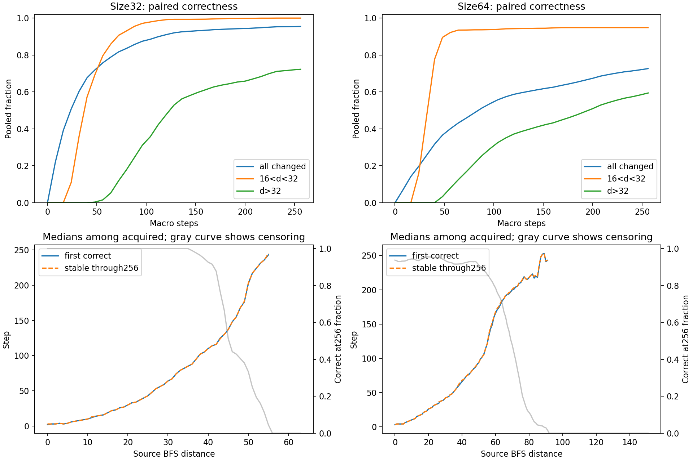
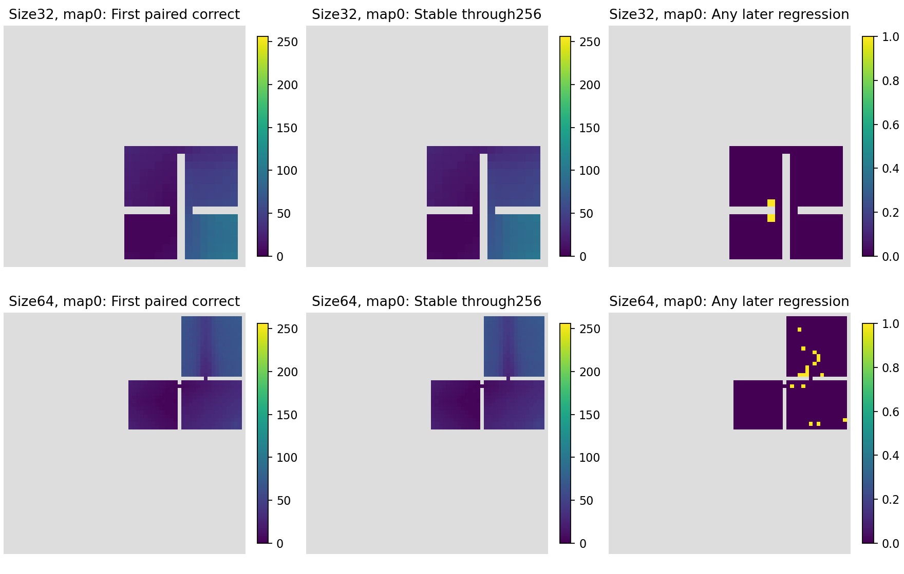

# Original Streaming seed4: behavior audit

Zero training, one selected checkpoint, original 32 maps at each size32/64. Every step0..256 was recorded. All six historical endpoint payloads replayed successfully.

## Endpoint replay

|Size|T|Primary strict16<d<32 pooled|All changed pooled|d>32 pooled|
|---|---:|---:|---:|---:|
|32|64|85.92%|78.85%|5.29%|
|32|128|99.35%|92.02%|52.89%|
|32|256|100.00%|95.48%|72.28%|
|64|64|93.50%|43.19%|12.48%|
|64|128|94.33%|59.59%|38.60%|
|64|256|94.85%|72.65%|59.43%|

## Retention versus turnover

|Size|Scope|Steps|Previously correct|Lost|Retained fraction|Gained|
|---|---|---|---:|---:|---:|---:|
|32|all_changed|64→128|6856|0|100.00%|1145|
|32|all_changed|64→256|6856|0|100.00%|1446|
|32|all_changed|128→256|8001|0|100.00%|301|
|32|strict_16_32|64→128|2507|0|100.00%|392|
|32|strict_16_32|64→256|2507|0|100.00%|411|
|32|strict_16_32|128→256|2899|0|100.00%|19|
|64|all_changed|64→128|19084|257|98.65%|7504|
|64|all_changed|64→256|19084|257|98.65%|13275|
|64|all_changed|128→256|26331|82|99.69%|5853|
|64|strict_16_32|64→128|8058|36|99.55%|107|
|64|strict_16_32|64→256|8058|36|99.55%|152|
|64|strict_16_32|128→256|8129|0|100.00%|45|

## Every-step acquisition

|Size|Changed pixels|Ever correct|Never correct through256|Correct at256|Ever regressed / ever correct|
|---|---:|---:|---:|---:|---:|
|32|8695|8303|392|8302|186/8303 (2.24%)|
|64|44188|33328|10860|32102|2768/33328 (8.31%)|

First passage and terminal stability are separate. Terminal stability means no later error in the recorded interval ending at256; it does not mean stability forever. Timing medians in summary.json condition on acquisition, with censor counts alongside.

## Frontier association

The full local behavior files contain every map/time/exact-BFS-distance stratum. Public frontier_matches_size32.csv / frontier_matches_size64.csv contain the common strata used in the matched comparison, with integer opportunities/acquisitions. Only common strata contribute to the weighted acquisition difference. This is descriptive association, not a causal neighbor handoff test; one macro step can use two graph hops.

|Size|Eligible maps|Matched map/time/distance strata|Equal-map mean acquisition difference|
|---|---:|---:|---:|
|32|31|1081|+30.92 pp|
|64|32|5801|+22.44 pp|

Within each map, weight common exact-distance/time strata by n_frontier*n_nonfrontier/(n_frontier+n_nonfrontier), then give maps equal weight. Acquisition is t→t+1 at t=0,8,...,248. There is no significance test.

## Reading order and limits

1. This report, summary.json and the figures below.
2. [Replay](replay_validation.json), [full saved-trace validation](validation.json), [publication arithmetic](publication_validation.json), and [diagnosis](DIAGNOSIS.md).
3. [Size32 matched strata](frontier_matches_size32.csv) and [size64 matched strata](frontier_matches_size64.csv). Full behavior JSON, evaluation payloads and compressed traces remain local; [provenance](provenance.json) binds their hashes. No raw arrays need to be opened first.

A positive retention/frontier pattern does not establish flood-fill, an invariant latent manifold, hidden-state boundedness, an optimization basin, or multi-seed reliability. All previous architecture gate verdicts remain unchanged.





Both maps are fixed map0. Gray means outside the changed component or no observed acquisition in that panel; colors show observed times only.

## Reproduction from this repository

Public matched effects and hash bindings can be checked without checkpoints:

```
python tools/export_frontier_audit.py --verify-only
python new/frontier_audit/check_metrics.py
```

Full trajectory replay requires the original local checkpoint and run/source bindings named by the frozen protocol; checkpoints and full traces are excluded from GitHub. The public checker verifies exported arithmetic, not a new model rollout.
