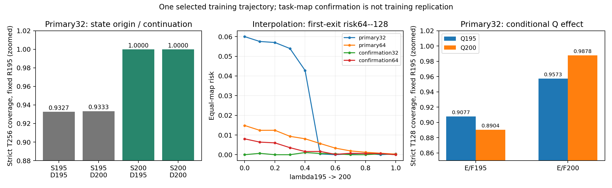

# Joint195/200: conditional state-production and coadaptation audit

COMPLETE492/492, zero training, 14.76 minutes. Four full historical endpoint traces replay exactly; all counterfactuals are finite.

Start with this report and [interpretation](INTERPRETATION.md). Complete numerical routing is [profiles.csv](profiles.csv), [case_index.json](case_index.json), and [factorial.json](factorial.json).

## Endpoints

All values below are equal-map percentages. Primary means changed/open/non-source (d>0); strict means16<d<32. Eligible maps and per-map counts remain in each compact case. Earlier dense reports also used pooled rates and included sources in turnover; compare matching estimands.

| Bank | Checkpoint | Strict T128 | Acquisition64--128 | First-exit64--128 | Survival64--256 |
|---|---:|---:|---:|---:|---:|
| primary32 | 195 | 90.7728 | 58.1209 | 6.0000 | 93.6200 |
| primary32 | 200 | 98.7799 | 65.9806 | 0.0463 | 99.9537 |
| primary64 | 195 | 98.8541 | 43.7715 | 1.4850 | 98.4922 |
| primary64 | 200 | 99.9750 | 51.2747 | 0.0289 | 99.9711 |
| confirmation32 | 195 | 98.3871 | 85.8911 | 0.0000 | 100.0000 |
| confirmation32 | 200 | 98.4677 | 84.7826 | 0.0000 | 100.0000 |
| confirmation64 | 195 | 96.2028 | 41.2597 | 0.8058 | 99.1942 |
| confirmation64 | 200 | 98.2903 | 43.8473 | 0.0000 | 100.0000 |

## Cross-continuation

Primary32, fixed readout195. Hidden dynamics do not depend on the readout.

| State at64 | Continuation | Strict T128 | Strict T256 | Shared-solved all-steps survival64--256 |
|---:|---:|---:|---:|---:|
| 195 | 195 | 90.7728 | 93.2683 | 93.6200 |
| 195 | 200 | 92.1898 | 93.3333 | 93.6200 |
| 200 | 195 | 96.6281 | 100.0000 | 100.0000 |
| 200 | 200 | 98.7799 | 100.0000 | 100.0000 |

The200-produced state can succeed under195 dynamics, while200 dynamics do not fully repair the195-produced state. This locates conditional pre64 state-production sensitivity; it does not make the continuation rule irrelevant.

## Full factorial, not a standalone Q verdict

Primary32, readout195. Other blocks stay195 unless listed.

| Blocks from200 | Strict T64 | Strict T128 | Strict T256 | First-exit64--128 |
|---|---:|---:|---:|---:|
| none | 72.1560 | 90.7728 | 93.2683 | 6.0000 |
| E | 72.5082 | 95.4986 | 99.9675 | 0.0512 |
| F | 73.5015 | 95.6537 | 100.0000 | 0.0437 |
| Q | 76.7749 | 89.0351 | 89.5285 | 8.8930 |
| EF | 73.4639 | 95.7349 | 100.0000 | 0.0000 |
| EFQ | 81.3628 | 98.7799 | 100.0000 | 0.0463 |

Q200 has a different effect in matching E/F200 versus E/F195 backgrounds. [All16 coalitions and24 orders](factorial.json) are retained, including large negative mixtures.

## Limits and validation

The primary32 interpolation improvement at.4->.5 mainly removes map10 failure.195 already performs well on independent32 maps. These banks replicate task-map checks, not training trajectories. Sparse local interventions and nonzero solved-state updates do not identify a unique local commitment law, physical phase transition or universally equivalent representations.

[Saved-artifact validation](validation/local_validation.json) uses CPU only. Checkpoints, states, raw NPZ traces, private execution receipts and the large duplicate analysis stay local; [provenance](input_provenance.json) retains their bindings. [Reproduction](REPRODUCTION.md) distinguishes compact public arithmetic checks from GPU inference. Earlier architecture no-go verdicts are unchanged.
